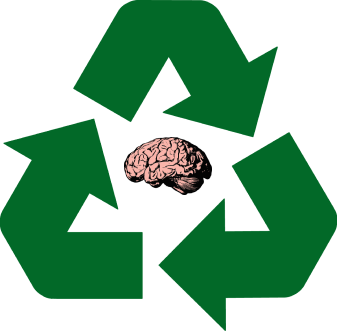
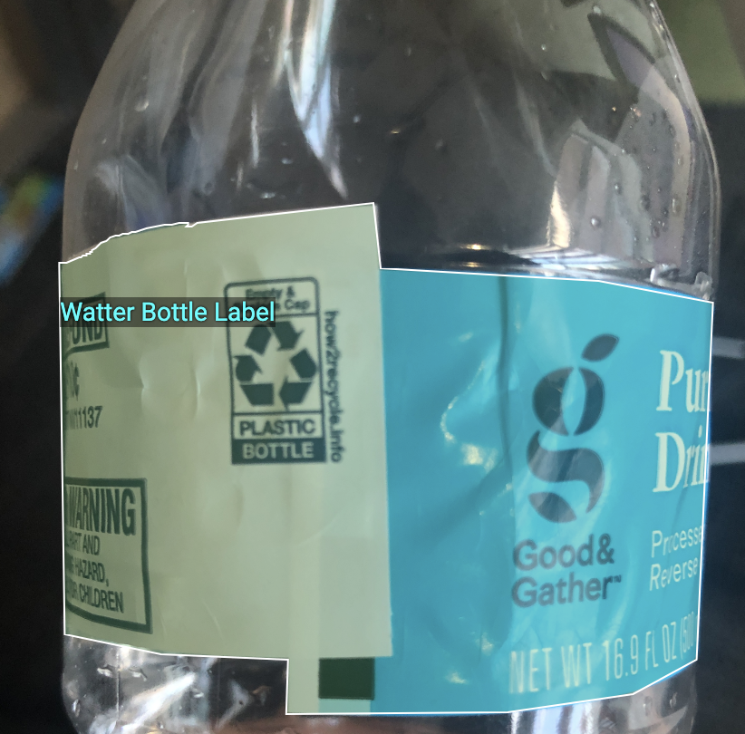
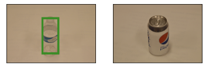

<div id="top"></div>

<!-- PROJECT SHIELDS -->
<!--
*** I'm using markdown "reference style" links for readability.
*** Reference links are enclosed in brackets [ ] instead of parentheses ( ).
*** See the bottom of this document for the declaration of the reference variables
*** for contributors-url, forks-url, etc. This is an optional, concise syntax you may use.
*** https://www.markdownguide.org/basic-syntax/#reference-style-links
-->

<!-- [![Contributors][contributors-shield]][contributors-url] -->
[![Forks][forks-shield]][forks-url]
[![Stargazers][stars-shield]][stars-url]
[![Issues][issues-shield]][issues-url]
[![MIT License][license-shield]][license-url]
<!-- [![LinkedIn][linkedin-shield]][linkedin-url] -->

<!-- PROJECT LOGO -->
<br />
<div align="center">
  <p>
    
 </p>

<h3 align="center">InnoTank</h3>

  <p align="center">
    Savin-novation for the Planet
    <!--<br />
    <a href="https://github.com/github_username/repo_name"><strong>Explore the docs »</strong></a>-->
    <br />
    <br />
<!--     <a href="https://drive.google.com/uc?export=download&id=1rY_OOOybkd8zDA7SwHek3I6_Cy2AyheE">Download Demo</a>
    · -->
    <a href="https://github.com/ROBOTECH2022-Software-Track/InnoTank/issues">Report Bug</a>
    <!--·
    <a href="https://github.com/github_username/repo_name/issues">Request Feature</a>
    -->
  </p>
</div>

<!-- TABLE OF CONTENTS -->
<details>
  <summary>Table of Contents</summary>
  <ol>
    <li>
      <a href="#about-the-project">About The Project</a>
      <ul>
        <li><a href="#built-with">Built With</a></li>
      </ul>
    </li>
<!--     <li>
      <a href="#getting-started">Getting Started</a>
      <ul>
        <li><a href="#prerequisites">Prerequisites</a></li>
        <li><a href="#installation">Installation</a></li>
      </ul>
    </li> -->
    <li><a href="#usage">Usage</a></li>
    <li><a href="#roadmap">Roadmap</a></li>
    <!--<li><a href="#contributing">Contributing</a></li>-->
    <li><a href="#license">License</a></li>
    <li><a href="#contact">Contact</a></li>
    <li><a href="#acknowledgments">Acknowledgments</a></li>
  </ol>
</details>

<!-- ABOUT THE PROJECT -->

## About The Project

InnoTech is proud to present our first product, InnoTank!

InnoTank is made to promote sustainability through fun.

The problem we wanted to tackle is the lack of recycling.<br/>
Recycling resources is one key aspect of sustainability.<br/>
Water bottles are not recyclable when there are labels on it or contents inside.

So, we made a fun, smart garbage bin that promotes sustainability through the fact that<br/>
people simply love chucking things into the garbage bin, especially water bottles.

Throw a water bottle at it, and it will succ it in.<br/>
Then, it will separate the content, label, and the bottle itself and stores them.

Simple, fun, and convenient.


[![Product Name Screen Shot][product-screenshot]](img/screenshot.png)

<p align="right">(<a href="#top">back to top</a>)</p>

### Built With

<!--* [Next.js](https://nextjs.org/) -->
#### Technologies:
- [Python](https://www.python.org/)
- [PyTorch](https://pytorch.org/)
- [Faster R-CNN](https://arxiv.org/abs/1506.01497)
- [Google Colab](https://colab.research.google.com/)
- [Recycling Dataset](http://web.cecs.pdx.edu/~singh/rcyc-web/index.html)
#### Design:
- [Google SketchUp](https://www.sketchup.com/?utm_source=google&utm_medium=paid_search&utm_campaign=&gclid=CjwKCAjwi6WSBhA-EiwA6Niok9Q9mxreO3QqAruaAIt4xhhKilbi__Pu8QsZaBJzzv8ungzH1-aBvhoCbCIQAvD_BwE)
- [Figma](https://www.figma.com)

<p align="right">(<a href="#top">back to top</a>)</p>

<!-- GETTING STARTED -->

<!-- ## Getting Started

### Prerequisites

In order to use the bot, you need to have a twitter account, create one [here](https://twitter.com)

### Installation

To create an habit tracking account, simple tag my bot () with "%a" before it. <br />
 -->

<!--
1. Get a free API Key at [https://example.com](https://example.com)
2. Clone the repo
   ```sh
   git clone https://github.com/github_username/repo_name.git
   ```
3. Install NPM packages
   ```sh
   npm install
   ```
4. Enter your API in `config.js`
   ```js
   const API_KEY = 'ENTER YOUR API';
   ```

<p align="right">(<a href="#top">back to top</a>)</p>
-->

<!-- USAGE EXAMPLES -->

## Usage
[YouTube Video](https://youtu.be/Gd6wWYjIP84)
<br/>
<br/>
**Design:** 
<br/>
<br/>

<br/>
<br/>
**How the InnoTank Detects a Water Bottle Lablel:**
<br/>
<br/>

<br/>
<br/>
**Water Bottle Recognition!:**
<br/>
<br/>


<p align="right">(<a href="#top">back to top</a>)</p>

<!-- ROADMAP -->

## What's Ahead

- [ ] 1: Real-time recognition
- [ ] 2: Recognize different objects (but will be rejected)
- [ ] 3: Succ the bottle inside the InnoTank
- [ ] 4: Adjust the bottle's orientation
- [ ] 5: Scan for label once the bottle is inside
- [ ] 6: Peel off the label if label is present
- [ ] 7: Label goes to a separate bin
- [ ] 8: Empty content to another container: if content is present
- [ ] 9: Squish bottle for space optimization
- [ ] 10: Store the squished bottle in the main container

See the [open issues](https://github.com/ROBOTECH2022-Software-Track/InnoTank/issues) for a full list of proposed features (and known issues).

<p align="right">(<a href="#top">back to top</a>)</p>

<!-- LICENSE -->

## License

Distributed under the MIT License. See `LICENSE.txt` for more information.

<p align="right">(<a href="#top">back to top</a>)</p>

<!-- CONTACT -->

## Contact

Phi Long Bui - [LinkedIn](https://www.linkedin.com/in/tonybui2003) - longphibui1993@gmail.com<br />
JK Kim - [LinkedIn](https://www.linkedin.com/in/jkkim2002) - ottersoodal@gmail.com<br />
Jeremhy Cesar - [LinkedIn](https://www.linkedin.com/in/jeremhy-cesar-a14bb2174/) - jeremhy.cesar31@gmail.com

<p align="right">(<a href="#top">back to top</a>)</p>

<!-- ACKNOWLEDGMENTS -->

## Acknowledgments

Thank you to GT IEEE for hosting RoboTech 2022!<br />
Thank you to all the sponsors and GT organizations for mentorships and workshops!
<p align="right">(<a href="#top">back to top</a>)</p>

<!-- MARKDOWN LINKS & IMAGES -->
<!-- https://www.markdownguide.org/basic-syntax/#reference-style-links -->

[contributors-shield]: https://img.shields.io/github/contributors/ROBOTECH2022-Software-Track/InnoTank.svg?style=for-the-badge
[contributors-url]: https://github.com/ROBOTECH2022-Software-Track/InnoTank/graphs/contributors
[forks-shield]: https://img.shields.io/github/forks/ROBOTECH2022-Software-Track/InnoTank.svg?style=for-the-badge
[forks-url]: https://github.com/ROBOTECH2022-Software-Track/InnoTank/network/members
[stars-shield]: https://img.shields.io/github/stars/ROBOTECH2022-Software-Track/InnoTank.svg?style=for-the-badge
[stars-url]: https://github.com/ROBOTECH2022-Software-Track/InnoTankstargazers
[issues-shield]: https://img.shields.io/github/issues/ROBOTECH2022-Software-Track/InnoTank.svg?style=for-the-badge
[issues-url]: https://github.com/ROBOTECH2022-Software-Track/InnoTank/issues
[license-shield]: https://img.shields.io/github/license/ROBOTECH2022-Software-Track/InnoTank.svg?style=for-the-badge
[license-url]: https://github.com/ROBOTECH2022-Software-Track/InnoTank/blob/main/LICENSE
[linkedin-shield]: https://img.shields.io/badge/-LinkedIn-blue.svg?style=for-the-badge&logo=linkedin&colorB=555
[linkedin-url]: https://www.linkedin.com/in/tonybui2003
[product-screenshot]: readme_img/img_detect.png
